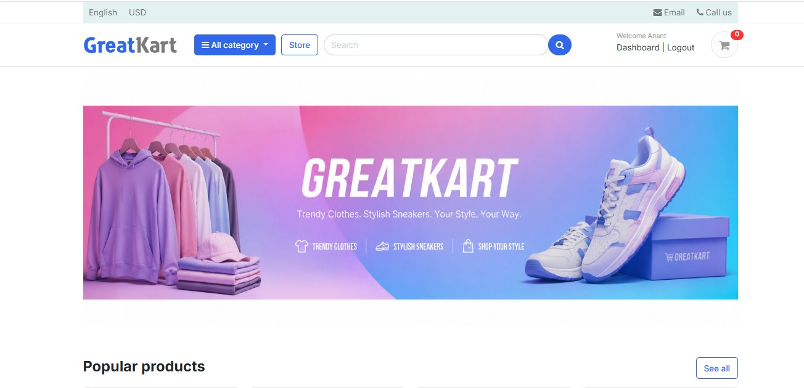
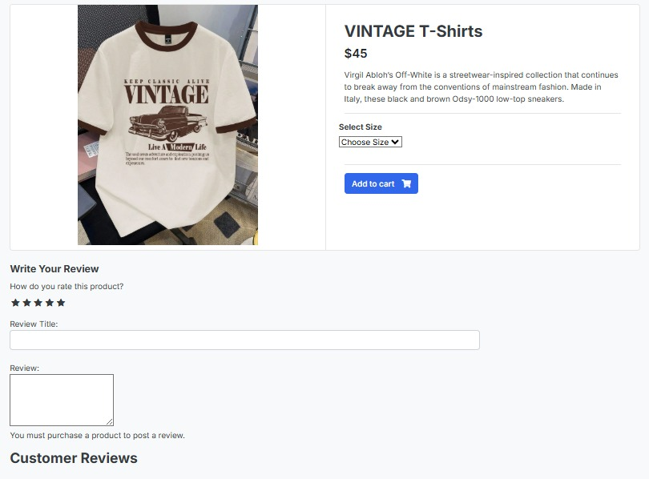
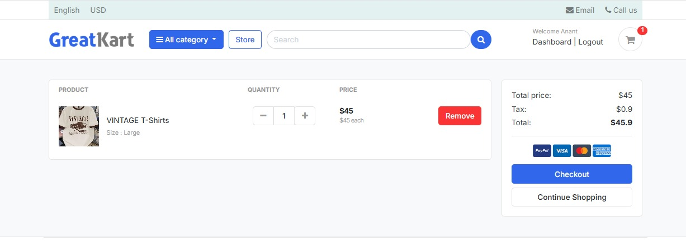
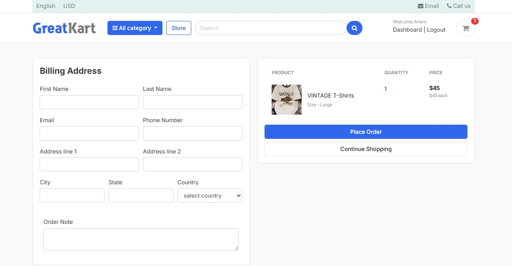
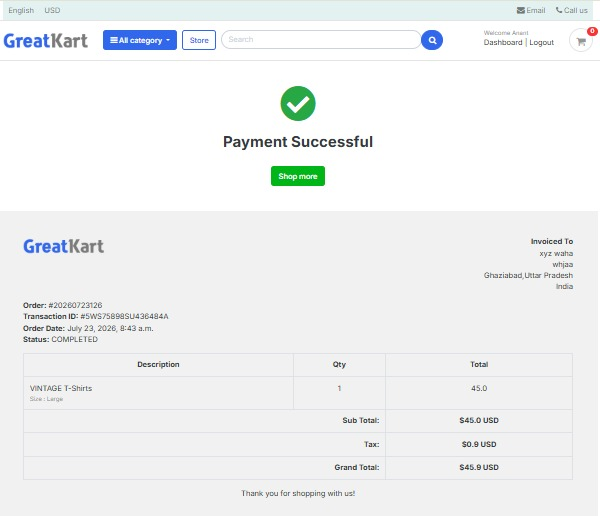

<h1>GreatKart 🛒</h1>
GreatKart is a fully functional, feature-rich e-commerce web application built using Python and Django. It provides a complete shopping experience from product browsing and cart management to secure checkout, order tracking, and product reviews.

<h3>🚀 Key Features</h3>
<b>Custom User Authentication:</b> Secure login, registration, and user dashboard using a custom Django user model.

<b>Product Catalog & Categories:</b> Dynamic product listings with category filtering and pagination.

<b>Product Variations:</b> Support for multiple product attributes (e.g., Size, Color) with precise cart management.

<b>Smart Shopping Cart:</b> Session-based cart functionality with quantity adjustments and real-time subtotal/tax calculations.

<b>Search Functionality:</b> Keyword-based search across product names and descriptions.

<b>Secure Checkout & Orders:</b> 
<ul>
<li>Generation of unique order numbers and transaction IDs.</li>

<li>Historical price freezing (saves the exact price of an item at the moment of checkout).</li>

<li>Post-checkout visual invoices and order history.</li>
</ul>

<b>Rating & Reviews:</b> Users can leave star ratings and text reviews for products they have purchased.

<b>Admin Dashboard:</b> Powerful Django admin interface to manage inventory, categories, orders, and users.

<h3>🛠️ Tech Stack</h3>
<b>Backend:</b> Python 3, Django

<b>Frontend:</b> HTML5, CSS3, Bootstrap (Responsive UI)

<b>Database:</b> SQLite (Development) / PostgreSQL (Production ready)

## 📸 Working Project Screenshots & Feature Walkthrough

*(Note: Save your screenshot images inside a folder named `screenshots/` in your root repository directory so these images render automatically).*

### 1. Storefront Homepage & Category Navigation

<br>
*Features dynamic product cards, category filtering in the navigation bar, and keyword search functionality.*

### 2. Product Detail Page & Variation Selection

<br>
*Shoppers can select specific variations (Size, Color), view real-time stock availability, and check average star ratings.*

### 3. Interactive Shopping Cart

<br>
*Session-based cart management allowing users to adjust item quantities, remove products, and view real-time tax and subtotal calculations.*

### 4. Checkout & PayPal Payment Integration

<br>
*Seamless address capture combined with a secure, sandbox-tested PayPal payment gateway integration.*

### 5. Order Generation & Printable Invoice

<br>
*Upon successful payment, the app freezes the purchase price, generates a unique transaction ID, and renders a clean, printable tax invoice.*

---

## 🚀 Starting the Project & Tracing the Application Flow

When you download this repository, here is exactly how the application boots up, where the code starts executing, and how the internal Django architecture handles user traffic:

### Step 1: Booting Up the Server (The CLI Entry Point)
To start the project locally, open your terminal inside the root folder, install the required packages, and execute Django's command-line utility:

```bash
pip install -r requirements.txt
python manage.py runserver
```
* **What happens behind the scenes:** `manage.py` is the primary trigger. It loads the master configuration from `GreatKart/settings.py`, connects to the database (`db.sqlite3` or PostgreSQL), and initializes the global middlewares and custom context processors.

---

### Step 2: The First Web Request (The HTTP Entry Point)
Once the server is running, navigating to `http://127.0.0.1:8000/` in a web browser triggers the core application flow:

1. **The Master Traffic Controller (`GreatKart/urls.py`):** Every incoming HTTP request hits this root URL configuration first. Because you are visiting the homepage (`""`), it routes traffic directly to the global `views.home` function located in `GreatKart/views.py`.
2. **The Core View Logic (`GreatKart/views.py`):** The `home` function acts as the initial data coordinator. It queries the `store` app's database model (`Product.objects.filter(is_available=True)`) to fetch all active products currently in stock.
3. **Global Context Injection:** Before sending HTML to the browser, Django automatically runs custom context processors (`carts/context_processors.py` and `category/context_processors.py`) to inject the live shopping cart item count and category navigation links into the session.
4. **Rendering the Frontend:** The combined database queries and session data are packaged and rendered through `templates/store/home.html`.

---

### Step 3: Branching Out (The User Journey Flow)
From the homepage, the application flow branches into specific Django apps depending on the user's actions:

```text
[Homepage Rendered] 
       │
       ├───► Click Category / Search ──────► [store app] Queries database & filters catalog
       │
       ├───► Click "Add to Cart" ──────────► [carts app] Generates session ID & updates quantities
       │
       ├───► Click "Proceed to Checkout" ──► [accounts app] Intercepts guest to enforce Login/Register
       │
       └───► Submit Payment ───────────────► [orders app] Freezes price, verifies PayPal & prints invoice
```

* **Exploring the Catalog (`store/`):** Clicking a product link sends its slug URL to `store/urls.py`, triggering `store/views.product_detail`. This view fetches variation options (sizes/colors) and pulls approved customer reviews from `models.ReviewRating`.
* **Managing the Shopping Bag (`carts/`):** Clicking "Add to Cart" routes to `carts/views.add_cart`. If the user is logged out, the system assigns a unique browser cookie (`session_key`) to track their items. When they log in later, the custom authentication backend automatically merges those session items into their permanent account cart.
* **Securing Checkout & Financials (`orders/`):** When initiating payment, `orders/views.place_order` generates a time-stamped order number and locks in the final price. Upon receiving a verified success payload from PayPal, `orders/views.payments` marks the transaction complete, saves the historical price history, and renders the final printable invoice.

---

## 🏗️ Developer Guide: Navigating the Codebase

This project strictly follows Django's **MVT (Model-View-Template)** architecture.

### 🚀 Project Entry Points
* **Terminal/CLI:** `manage.py` is the entry point for all local development commands (e.g., running the server, making migrations).
* **HTTP Requests:** `GreatKart/urls.py` acts as the root traffic controller, catching all user requests and routing them to the appropriate app.
* **Production:** `GreatKart/wsgi.py` serves as the entry point for production web servers (like Gunicorn) to communicate with the application.

---

## 📂 Complete Project File Structure

Below is the directory tree of the GreatKart e-commerce platform, illustrating the modular separation of Django apps, static assets, media storage, and HTML templates:

```text
GreatKart/
│
├── accounts/                  # User authentication & profile management app
│   ├── migrations/
│   ├── admin.py
│   ├── forms.py
│   ├── models.py              # Custom User Model & UserProfile
│   ├── urls.py
│   └── views.py               # Login, register, activation & dashboard logic
│
├── carts/                     # Shopping cart math & session logic app
│   ├── migrations/
│   ├── context_processors.py  # Global cart item counter for navbar
│   ├── models.py              # Cart & CartItem database models
│   ├── urls.py
│   └── views.py               # Add, remove, and decrement cart item logic
│
├── category/                  # Product category management app
│   ├── migrations/
│   ├── context_processors.py  # Global category dropdown menu loader
│   ├── models.py              # Category model with custom slug URLs
│   └── views.py
│
├── GreatKart/                 # Inner core project configuration folder
│   ├── static/                # Core static overrides
│   ├── asgi.py
│   ├── settings.py            # Main project configuration & database connection
│   ├── urls.py                # Master URL routing controller
│   ├── views.py               # Global views (e.g., Homepage rendering)
│   └── wsgi.py                # Production web server gateway interface
│
├── media/                     # User-uploaded content & product catalogs
│   └── photos/
│       ├── category/          # Category display banners
│       └── products/          # Individual product images
│
├── orders/                    # Checkout, payments & invoice handling app
│   ├── migrations/
│   ├── admin.py
│   ├── forms.py               # Shipping address capture form
│   ├── models.py              # Order, OrderProduct, and Payment models
│   ├── urls.py
│   └── views.py               # PayPal gateway processing & receipt rendering
│
├── static/                    # Global front-end static assets
│   ├── admin/                 # Custom admin stylesheet overrides
│   ├── css/                   # Stylesheets for storefront layout
│   ├── fonts/                 # Custom web fonts
│   ├── images/                # Static UI logos, icons, and banners
│   └── js/                    # Client-side JavaScript & interactive scripts
│
├── store/                     # Storefront catalog & review management app
│   ├── migrations/
│   ├── admin.py
│   ├── forms.py               # Review & rating submission form
│   ├── models.py              # Product, Variation, and ReviewRating models
│   ├── urls.py
│   └── views.py               # Search engine & category filtering logic
│
├── templates/                 # Global HTML visual templates
│   ├── accounts/              # Auth UI (login, register, reset password, dashboard)
│   ├── includes/              # Reusable components (navbar, footer, alerts)
│   ├── orders/                # Payment page & order confirmation invoices
│   └── store/                 # Main storefront (home, base layout, product detail)
│
├── .gitignore                 # Specifies intentionally untracked files for Git
├── db.sqlite3                 # Local SQLite development database
├── manage.py                  # Django command-line execution utility
├── README.md                  # Project documentation & visual walkthrough
└── requirements.txt           # Python package dependency list
```
